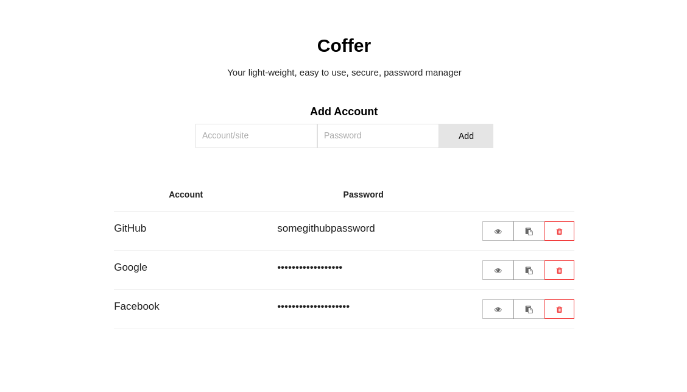

*Coffer is very much in development - and should not be used seriously. - NO PASSWORDS ARE ENCRYPTED AS OF YET*

Coffer is a light-weight password manager built ontop of Go's secure backend, with Electron + React serving a beautiful front-end with an  intuitive UI.

# Dependencies
- Golang
- Electron
- Node/NPM
- [gb](https://getgb.io)

# Run me
- Clone the repo, `git clone https://github.com/spaceshuttl/coffer`
- Change into the directory and install dependencies, `cd coffer && npm install`
- Build the Go binary, `gb build all`
- Install Electron globally, `npm install -g electron`
- Run Coffer, `electron .`

*Note: There is a unison build system coming soon, hopefully there will be a single binary you can run.*

## Data retention
Coffer stores all passwords within a local file. All transations to the file are encrypted with AES (tbc), so all data kept is safe.

# TODO

### Backend
- [X] Rewrite endpoints in gorilla/websocket
- [X] Rewrite backend into neat unison API to be used.
- [X] Encrypt disk transaction
- [ ] Write test + fuzz the endpoint

### Frontend
- [X] Write up html structure
- [X] Write React components
- [X] Experiment with AJAX vs WebSockets
- [X] Automatically hide passwords, show on click/hover
- [X] Bind WS calls to the store for seemless data sync

### Meta
- [X] Add bower dependency management system
- [X] Create unison build system
- [-] Create cross-platform building and packing
