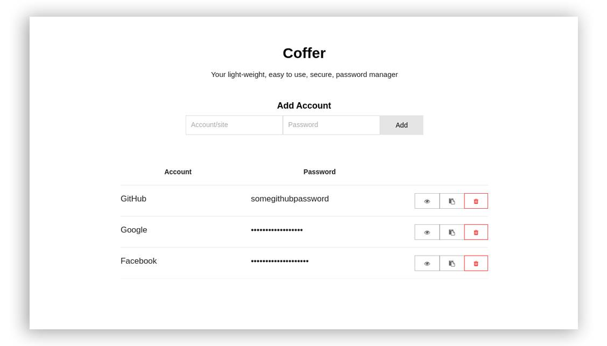

*Coffer is very much in development - and should not be used to store import information*



Coffer is a light weight password manager built with Go, React, and Electron.

# Install (TBC)
To install Coffer you can download the pre-compiled binary from the ['releases'](https://github.com/spaceshuttl/coffer/releases/latest) section of GitHub, just select the version for your OS and architecture and download Coffer.

# Development
We actively welcome PRs and love to see the community contributing to Coffer. If you want to open a PR for a feature, or just want to hack on it, follow the intstructions below.

## Install dependencies
- Install GB, the vendoring Go vendoring tool
  ```bash
  go get github.com/constabulary/gb/...
  ```
- Install Electron + electron-packager globally for your OS
  ```bash
  npm install -g electron electron-packager
  ```

## Setting up coffer
- Clone the repo, `git clone https://github.com/spaceshuttl/coffer.git`
- cd into the directory, install dependencies,
  ```bash
  cd coffer && npm install
  ```
- Build the repo, `make build`
- Run the backend `./bin/service`
- Run the front end, `npm run electron`

*Note: There is a unison build system coming soon, hopefully there will be a single binary you can run.*

# Data retention
Coffer stores all passwords within a local file (`~/.coffer/store.bolt` by default.) All writes to the disk are encrypted with AES-256.

# TODO

### Backend
- [X] Rewrite endpoints in gorilla/websocket
- [X] Rewrite backend into neat unison API to be used.
- [X] Encrypt disk transaction
- [ ] Add SSL support to the WS connection
- [-] Write tests

### Frontend
- [X] Write up HTML structure
- [X] Write React components
- [X] Implement WebSockets
- [X] Automatically hide passwords, show on click/hover
- [ ] Implement some store to hold the WS connection

### Meta
- [ ] Add bower dependency management system
- [ ] Create build + packing system
